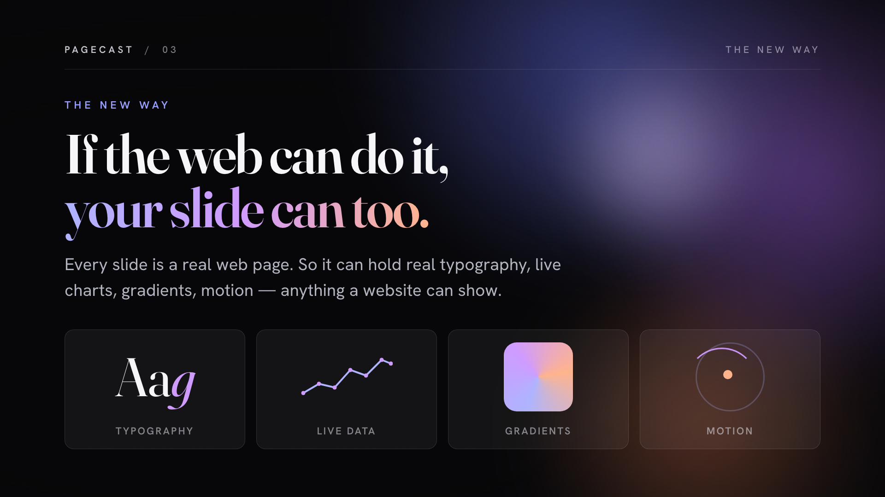
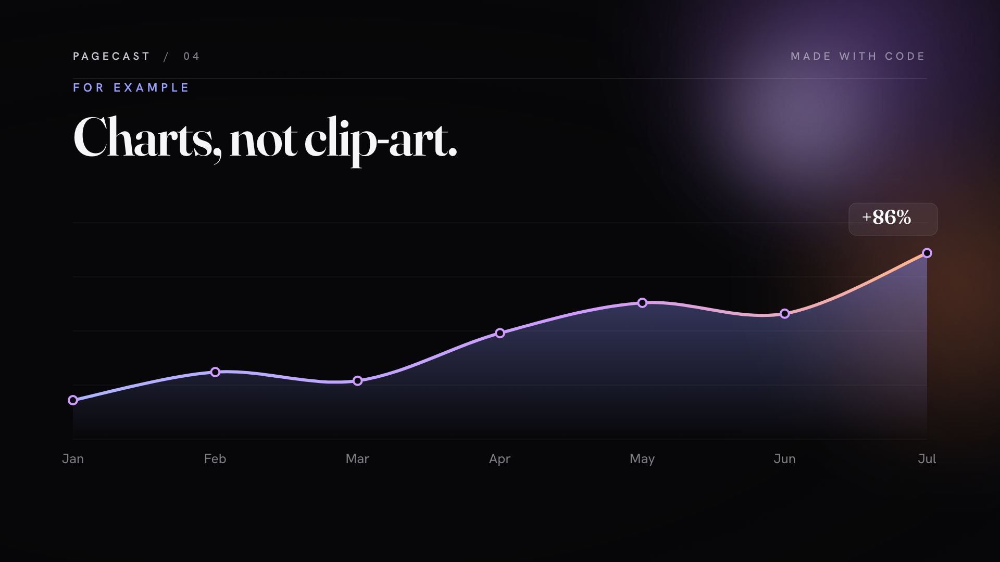
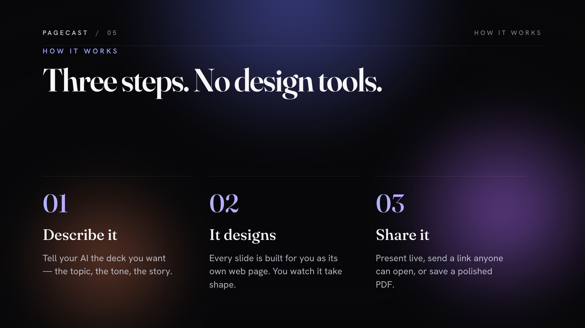

<div align="center">

# Pagecast

### Slides that are real web pages.

Design decks with your AI agent · present in the browser · export to PDF · share with a link.

[](./LICENSE)
&nbsp;[](https://nodejs.org)
&nbsp;[](./CLAUDE.md)
&nbsp;[](#contributing)

<br />


<br />
<br />

[Quick start](#quick-start) · [How it works](#how-it-works) · [The CLI](#the-cli) · [Publishing](#publishing) · [Security](#security)

</div>

---

## Why Pagecast

Every other slide tool boxes you in — templates, drag‑and‑drop, a proprietary file you can't grep. Pagecast takes the opposite bet: **a slide is just a web page.** Each one is a React component, so it can do anything the web can — real typography, hand‑drawn SVG charts, live data, animation. There is no editor to fight and no format to be trapped in.

That makes it the first slide tool built for the way people work now: **you describe the deck, your AI agent writes the components.** The repo is the storage layer, the CLI is the API, and git is the history. No backend, no database, no account.

- 🧩 **Slides are code** — a `.tsx` component per slide, 1920×1080, anything React renders.
- 🤖 **Agent‑native** — hand the repo to Claude (or any coding agent); [`CLAUDE.md`](./CLAUDE.md) is its manual.
- 📦 **Just files** — decks are JSON manifests listing slide paths. Greppable, diffable, yours.
- 🖨️ **Pixel‑perfect PDF** — headless Chromium renders any deck to a real 1920×1080 PDF.
- 🚀 **Share in one command** — turn a deck into a public link anyone can open (hosted free on Cloudflare Pages).
- 🔒 **Local‑first & private** — nothing leaves your machine until *you* publish, and publishing is [isolated to one deck](#security).

## A deck, built by Pagecast

<div align="center">

&nbsp;
&nbsp;
<br />
<sub>Every slide above is a web page — designed by an agent, rendered straight to this README. No template did that.</sub>
</div>

## Hand it to your agent

Pagecast is designed so an AI agent can drive the whole thing. Clone the repo, open it with your agent (Claude Code, cowork, or Claude Desktop with file/shell access), and say:

> **“Set up Pagecast and show me the example deck.”**

Then just describe what you want:

> **“Make me a 6‑slide deck pitching our new product — title, the problem, our solution, how it works, pricing, and a closing call‑to‑action.”**

The agent installs, scaffolds, writes the slide components, and opens the viewer. You react; it iterates. Prefer to drive it yourself? Everything it does, you can do — read on.

## Quick start

> **Prerequisite:** [Node.js 20.19+](https://nodejs.org) (current LTS recommended).

```bash
git clone https://github.com/az-hussain/pagecast
cd pagecast
npm install          # the entire required setup
npm run dev          # → http://localhost:5173
```

That's everything you need to view and edit decks. Run `npm run doctor` any time to see what's ready and the one‑line fix for anything that isn't. Two capabilities install on first use, each guided:

| Capability | First‑time step |
| --- | --- |
| **PDF export** | `npx playwright install chromium` (~90 MB, once) |
| **Publishing** | `npx wrangler login` (free Cloudflare account; the one step only you can do) |

Setup is **progressive** — you only ever install what your next action needs.

## How it works

```
slides/                  Reusable slides, shared across decks
  shared/examples/title.tsx
decks/
  my-deck/
    deck.json            { "title": "...", "slides": ["slides/…", "decks/…"] }
    slides/
      cover.tsx          A slide that belongs to only this deck
```

Two ideas, that's the whole model:

1. **A slide is a React component** that wraps its content in `<Slide>` (which enforces the 1920×1080 canvas):

   ```tsx
   import { Slide } from '@/components/Slide'

   export const meta = { title: 'Quarterly growth' }

   export default function Growth() {
     return (
       <Slide>
         <div style={{ padding: 120 }}>
           <h1 style={{ fontSize: 96, margin: 0 }}>Up and to the right</h1>
           {/* render any React you want — the canvas is 1920×1080 */}
         </div>
       </Slide>
     )
   }
   ```

2. **A deck is a JSON manifest** — an ordered list of slide paths. Reordering is a CLI command, never a file rename; the manifest is the single source of truth for order.

## The CLI

The surface your agent drives (and you can too). Every command exits non‑zero with a useful message on failure.

| Command | What it does |
| --- | --- |
| `npm run doctor` | Check the environment; report what's ready and how to fix gaps. **Run this first.** |
| `npm run dev` | Dev server with hot reload at http://localhost:5173. |
| `npm run new:deck -- <name> [--title "…"]` | Scaffold a new deck (kebab‑case name). |
| `npm run new:slide -- <path>` | Create a shared slide at `slides/<path>.tsx`. |
| `npm run new:slide -- --deck <name> <path>` | Create a deck‑local slide. |
| `npm run add:slide -- <deck> <slide-path> [--at <pos>]` | Add a slide to a deck (1‑based position). |
| `npm run move:slide -- <deck> <from> <to>` | Reorder. `<to>` is a 1‑based index, `start`, or `end`. |
| `npm run remove:slide -- <deck> <pos-or-path>` | Remove a slide from a manifest (keeps the file). |
| `npm run edit:deck -- <name> [--title …] [--author …]` | Update deck metadata. |
| `npm run export -- <deck> [--out file.pdf]` | Render the deck to a 1920×1080 PDF. |
| `npm run publish -- <deck> [--prefix <p>]` | Deploy one deck to Cloudflare Pages; returns a public URL. |
| `npm run unpublish -- <deck>` | Take a published deck offline. |

## Presenting

Open `http://localhost:5173/decks/<name>` to drop into the viewer.

| Key | Action | | Key | Action |
| --- | --- | --- | --- | --- |
| `→` `Space` | Next | | `F` | Fullscreen |
| `←` | Previous | | `S` | Toggle slide strip |
| `1`–`9` | Jump to slide | | `Esc` | Exit |

## Publishing

```bash
npx wrangler login                 # one-time: free Cloudflare account, opens your browser
npm run publish -- my-deck
# → https://pagecast-my-deck.pages.dev
```

`publish` builds a self‑contained static site for **one** deck and deploys it to [Cloudflare Pages](https://pages.dev). Wrangler isn't a dependency — `npx` fetches it on demand, so a normal `npm install` stays lean.

> **pages.dev URLs are public and unauthenticated.** Don't publish confidential material; send the PDF instead. Set a distinctive `projectPrefix` in `.pagecast/config.json` so your URLs don't collide on the shared namespace.

## Security

Pagecast is a local authoring tool — build and dev tooling runs only on your machine and is never shipped in published decks or PDFs. Two guarantees worth knowing:

- **Publishing is isolated to one deck.** A published bundle contains only the chosen deck's manifest and slides. Other decks in the repo — even confidential ones sitting right next to it — are never bundled, and a cross‑deck `import` fails the build instead of leaking.
- **Speaker notes are stripped** from published bundles, fail‑closed (the build errors rather than risk leaking a note it can't fully remove).

See [SECURITY.md](./SECURITY.md) for the full threat model and how to report a vulnerability.

## What Pagecast is *not*

- **Not a SaaS.** No backend, no database, no accounts. The repo is the storage layer.
- **Not WYSIWYG.** Slides are code — that's the point; it's what lets an agent build them.
- **Not a chart library.** Use SVG, or import whatever you like. It's React.
- **Not multiplayer.** Two people editing one `deck.json` is a git merge, not a feature.

## Contributing

Issues and PRs are welcome. To hack on Pagecast: `npm install`, `npm run dev`, and `npm run build` before opening a PR. New CLI commands live in `scripts/`; the app is in `src/`. If you change how slides or decks are discovered, keep the publish‑build isolation in [`vite.publish.config.ts`](./vite.publish.config.ts) in sync — it's what keeps decks from leaking into each other.

## License

[MIT](./LICENSE) © Azhar Hussain
